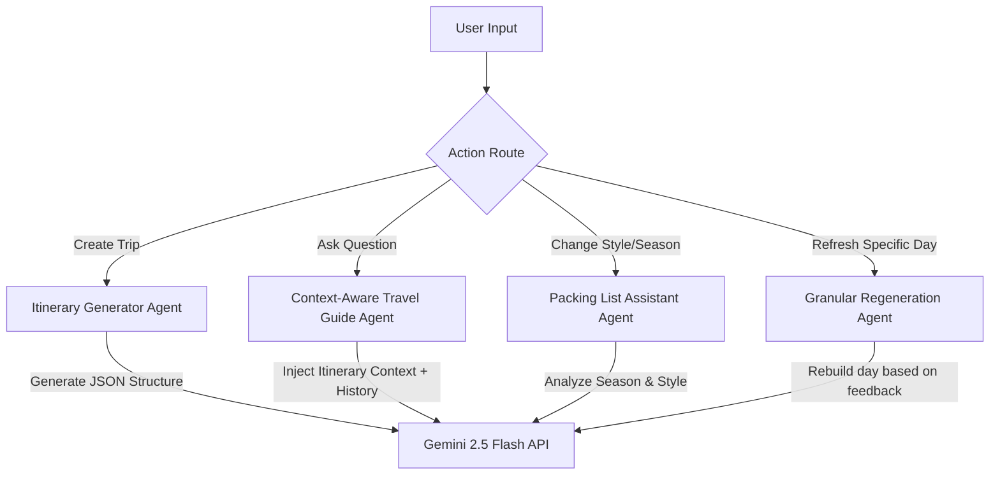

# Trao — AI-Powered Travel Planner 🌍✈️

Trao is a premium, production-ready AI travel planner designed to streamline trip creation, budget tracking, weather analysis, and group coordination. It instantly generates comprehensive day-by-day travel itineraries, suggests budget-aligned hotels, computes itemized cost estimates, forecasts local weather, generates packing checklists, and facilitates sharing public links.

---

## 🌟 Key Features & Creative Modules

- 🤖 **AI-Powered Itinerary Generation** — Detailed daily routes and activities tailored to custom cities, trip durations, budget tiers, and traveler interests.
- 📊 **Interactive Analytics Dashboard** — Real-time metrics for **Total Trips**, **Countries Explored** (only unique regions actually completed/visited), **Total Capital Investment**, and **Upcoming/Scheduled Trips**.
- 🗺️ **Interactive Route Maps** — Visual markers and routes highlighting hotel lodging and daily activity spots utilizing an offline geographic dispersion algorithm.
- 💬 **Context-Aware Travel Assistant** — An AI chat companion right inside your workspace, ready to answer questions, suggest local dining, suggest packing lists, and help refine your trip details.
- ⛈️ **Weather Forecasts & Safety Advisories** — Live 7-day weather predictions showing temperature spreads, rain probabilities, conditions, and travel warnings (e.g., UV levels, storm alerts).
- 📅 **Dynamic Calendar Forecast Dates** — Real dates (e.g., Jun 19, Jun 20) computed dynamically relative to your trip starting date and mapped directly onto forecast days.
- ✅ **Exploration Status Tracking** — Inline checkboxes and badges to separate *planned* trips from *explored/visited* countries.
- 🧳 **Dynamic Weather Packing Assistant** — Packing checklists generated based on the destination's season, travel styles, and climate notes. Pack items can be checked off in real time or regenerated dynamically.
- 🔗 **Public Collaboration Links** — Share trip itineraries instantly with a clean public-view page format (no authentication required for viewers).
- 🖨️ **Clean PDF & Print Export** — Print your itinerary or save it as a PDF via a custom-styled printable sheet layout.
- 🔑 **Next-Gen Authentication & Session Isolation**:
  - JWT token auth with strict database isolation.
  - One-click Google OAuth Sign-in/Sign-up.
  - **Multi-Tab Session Isolation** (`sessionStorage` integrated) — Run multiple accounts on different tabs concurrently without state overlaps or sudden logouts.

---

## 🛠️ Chosen Tech Stack & Justification

| Layer | Technology | Justification |
| :--- | :--- | :--- |
| **Frontend** | **Next.js 16 (App Router) + TypeScript** | Enables server-side rendering (SSR) optimization, modular routing, strict compile-time type safety, and premium component state management. |
| **Styling** | **Tailwind CSS (v4)** | Allows ultra-high performance utility styling, native CSS variables customization, and quick construction of clean glassmorphic layers. |
| **Backend** | **Node.js + Express.js** | Provides an asynchronous, lightweight runtime engine optimized for high-throughput JSON API services and middleware chains. |
| **Database** | **MongoDB Atlas + Mongoose** | Perfect for document flexibility. Allows storing complex nested JSON structures like daily activities, hotels, and arrays of checklist objects without rigid relational migrations. |
| **AI Engine** | **Gemini (gemini-2.5-flash)** | Offers high inference speed, a massive context window for historical chat context, and native support for structured JSON generation (`responseMimeType: 'application/json'`). |
| **Auth** | **JWT (JSON Web Tokens) + Google Identity OAuth + bcryptjs** | Secures resource routes with stateless web tokens, handles secure password hashing, and delivers simple single-click login. |

---

## 🗺️ High-Level Architecture Explanation

Trao is structured as a decoupled monorepo client-server architecture:

```
ai-travel-planner/
├── backend/
│   ├── config/              # DB Connect configurations (db.js)
│   ├── middleware/          # JWT authorization validation (auth.js)
│   ├── models/              # Mongoose schemas representing database collections (User, Trip)
│   ├── controllers/         # Core business handler logic (authController, tripController)
│   ├── routes/              # Express endpoint mappings to controllers (auth, trips)
│   └── server.js            # Node Entry Point
└── frontend/
    ├── app/                 # Next.js App Router folders (dashboard, login, register, share, workspace)
    ├── components/          # Reusable UI modules (Analytics, Map, Budget, Chat, Weather, Packing)
    ├── context/             # React Context Providers (AuthContext, ToastContext)
    ├── utils/               # Fetch API wrappers (api.ts)
    └── types/               # Type Interfaces definitions (Activity, Hotel, Trip, User)
```

### 📡 Data & API Request Flow
1. **Client Action**: The user selects trip details in `CreateTripForm.tsx` and sends a `POST` request to `backend/routes/trips.js`.
2. **Auth Verification**: The `auth.js` middleware interceptor verifies the token header, injecting the parsed user identity `req.user`.
3. **AI Generation**: `tripController.js` constructs a strict structural instruction prompt, calls Gemini API, gets structured JSON, adds fallback coordinates, and commits the document to MongoDB.
4. **Data Synchronization**: The workspace receives the saved document, populating the interactive map, weather forecasts, packing list, and context-aware chat assistant.

---

## 🔑 Authentication & Authorization Approach

We use a dual-option authentication mechanism designed for flexibility, safety, and testing flexibility:

### 1. Traditional JWT Credentials Flow
- **Registration**: Users submit name, email, and password. Passwords are cryptographically salted and hashed using `bcryptjs` via a pre-save database hook.
- **Session Verification**: Standard `jsonwebtoken` creates a cryptographically signed payload valid for 7 days.
- **Security Check**: Private API endpoints verify incoming `Authorization: Bearer <token>` headers through `auth.js` middleware.

### 2. Federated OAuth with Google Identity
- Integrated via `@react-oauth/google` on the frontend, verifying tokens on the backend using Google's `google-auth-library`.
- Gracefully auto-links with existing traditional email accounts if Google credentials match a pre-existing email address.

### 3. Multi-Tab Session Isolation
> [!IMPORTANT]
> Traditional applications store tokens in `localStorage`, which propagates the token across all browser windows and tabs. If you try to open two tabs to test different users or check separate accounts, the sessions overwrite each other.
>
> **Trao isolates sessions using `sessionStorage`**. Each tab runs a completely isolated sandbox. You can log into a "Premium Host" account in Tab A and a "Budget Backpacker" account in Tab B concurrently without session leaking.

---

## 🤖 AI Agent Design & Purpose

Trao's AI engine is modeled as a multi-functional travel agent that performs distinct orchestration tasks:



### 1. Prompt Constraints & Structured Outputs
To avoid parsing errors and AI hallucinations, we configure Gemini using `generationConfig: { responseMimeType: 'application/json' }`. We outline exactly what the schema needs to return, including activities arrays, hotel tiers, packing categories, and climate notes.

### 2. Context-Aware Travel Guide Agent (Chatbot)
When a user chats with the AI travel companion within a workspace:
- We capture the user's message.
- We pull the current itinerary text, hotel recommendation objects, estimated budget totals, traveler interests, and recent chat history records.
- We package this raw data inside a comprehensive system prompt prefixing the user's message.
- This gives the agent deep situational context, allowing it to give tailored dining tips, cafe ideas, and transit routes without forcing the user to retype details.

### 3. Granular Day Regeneration Workflow
Instead of forcing the user to regenerate an entire multi-day trip when they dislike a single activity, the agent allows rebuilding a specific day:
- The user provides targeted feedback (e.g., "make the afternoon plan include hiking").
- The controller sends the feedback along with previous day activities to Gemini.
- Gemini returns a single day schema, which is updated inside the main document.

---

## 💡 Creative & Custom Features

### 1. Interactive Route Map Fallback Generator
To prevent broken maps when API keys are missing or geocoding services are blocked, we built an offline math-dispersion mapping engine:
- If activities do not contain coordinates, we check a predefined dictionary of global city coordinate centers (Paris, London, Tokyo, NYC, Rome, etc.).
- If the city is missing, we compute a deterministic latitude/longitude hash based on the name of the destination.
- We distribute activities and hotels around the center coordinates using mathematical offsets using sine and cosine functions.
- We draw a dashed polyline flow indicating travel direction.

### 2. Dynamic Weather Packing Assistant
Instead of generic packing templates, packing checklists are dynamically generated according to the trip destination, duration, season, and travel style (e.g. leisure, active, business). The list separates items into categorized cards (Documents, Clothing, Gear, and Other) and offers live checklists saved to MongoDB.

### 3. Exploratory Dashboard Analytics
An interactive tracking page aggregates real-time indicators across all user trips:
- **Total Capital Investment**: Real-time sum of generated hotel, transport, and dining budgets.
- **Countries Explored**: Evaluated strictly based on trips marked as `isCompleted: true`, giving an accurate record of completed journeys.

---

## ⚙️ Key Design Decisions & Trade-offs

- **Session Isolation over Cross-Tab Persistence**:
  *Trade-off:* By using `sessionStorage`, closing a browser window clears the login state, requiring the user to sign back in. However, this protects user privacy on shared terminals and allows multiple tabs to test separate accounts cleanly.
- **Static Coordinate Dispersion over Live Geocoding APIs**:
  *Trade-off:* Using offline geocoding dictionary calculations eliminates paid API dependencies (e.g. Mapbox, Google Maps API limits) and prevents latency overhead, but it places markers in relative geometric patterns around city centers rather than exact street addresses.
- **Single-Document Cache Pattern**:
  *Trade-off:* We store itinerary details, hotel recommendations, packing checkboxes, and chat history under a single Mongoose document. This makes operations fast with one database read, but means the chat history size must be capped to prevent exceeding MongoDB's 16MB document size limits.

---

## ⚠️ Known Limitations

1. **Map Pin Accuracy**: Pins show the general vicinity of activities and hotels inside the destination city, but they do not point to exact coordinates since live search geocoding is omitted.
2. **Generative Budget Values**: Budget estimates are approximate values generated by the AI model. They are not connected to real-time aggregators (like Skyscanner or Agoda) and should be used as guides.
3. **Chat History Bounds**: Large travel logs and long chat histories are pruned/cleared upon trip duplication to optimize storage limits.

---

## ⚡ Quick Start & Setup Instructions

### Prerequisites
- Node.js 18+ installed on your system
- A MongoDB Atlas database cluster ([cloud.mongodb.com](https://cloud.mongodb.com))
- A Google AI Studio API Key ([aistudio.google.com](https://aistudio.google.com))

---

### Local Setup Instructions

#### 1. Backend Server Setup
1. Navigate to the backend directory:
   ```bash
   cd backend
   ```
2. Create a `.env` file based on `.env.example`:
   ```bash
   cp .env.example .env
   ```
3. Configure the environment variables in `backend/.env`:
   ```env
   PORT=5000
   MONGO_URI=mongodb+srv://<username>:<password>@cluster.mongodb.net/trao
   JWT_SECRET=your_jwt_signing_key_here
   GEMINI_API_KEY=your_gemini_api_key_here
   GOOGLE_CLIENT_ID=your_google_oauth_client_id_here
   ```
4. Install dependencies:
   ```bash
   npm install
   ```
5. Launch the backend development server:
   ```bash
   npm run dev
   ```
   *The API will start running at `http://localhost:5000`*

---

#### 2. Frontend App Setup
1. Navigate to the frontend directory:
   ```bash
   cd ../frontend
   ```
2. Create or verify the local environment file `frontend/.env.local`:
   ```env
   NEXT_PUBLIC_API_URL=http://localhost:5000
   NEXT_PUBLIC_GOOGLE_CLIENT_ID=your_google_oauth_client_id_here.apps.googleusercontent.com
   ```
3. Install dependencies:
   ```bash
   npm install
   ```
4. Start the frontend Next.js development server:
   ```bash
   npm run dev
   ```
   *The application client will run at `http://localhost:3000` (or `http://localhost:3001` if port 3000 is occupied)*

---

### Deployed Production Setup Instructions

To deploy the application to cloud hosting platforms:

#### 1. API Backend Deployment (e.g., Render, Heroku)
- Link your repository to the service.
- Set the Build Command: `npm install` (within the `backend` subdirectory).
- Set the Start Command: `node server.js` or `npm start`.
- Configure the environment variables in your provider's settings (`MONGO_URI`, `JWT_SECRET`, `GEMINI_API_KEY`, `GOOGLE_CLIENT_ID`).

#### 2. Next.js Client Deployment (e.g., Vercel, Netlify)
- Import your repository.
- Set the framework preset to `Next.js`.
- Set the Root Directory to `frontend`.
- Add environment variables:
  - `NEXT_PUBLIC_API_URL` (pointing to your deployed API Backend domain).
  - `NEXT_PUBLIC_GOOGLE_CLIENT_ID` (your Google Client ID).
- Click Deploy.
